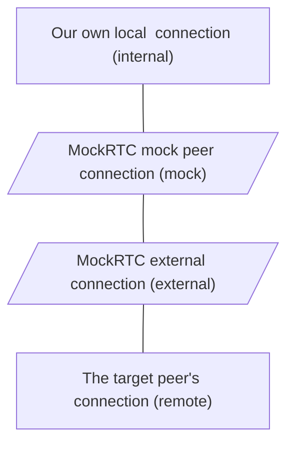

# MockRTC [](https://github.com/httptoolkit/mockrtc/actions) [](https://npmjs.com/package/mockrtc)

> _Part of [HTTP Toolkit](https://httptoolkit.tech): powerful tools for building, testing & debugging HTTP(S), WebSockets and WebRTC_

MockRTC lets you intercept, assert on and mock WebRTC peers. This makes it possible to:

* Build automated tests for WebRTC traffic.
* Simulate WebRTC errors in a reliable reproducible way.
* Capture and inspect traffic between real WebRTC peers for debugging.
* Create WebRTC proxy peers to automate message transformation, monitoring or logging.

---

:warning: _MockRTC is still new & rapidly developing!_ :warning:

_Everything described here works today, but there's lots more to come, and some advanced WebRTC use cases may run into rough edges. If you hit any problems or missing features, please [open an issue](https://github.com/httptoolkit/mockrtc/issues/new)._

---

## Example

Let's write an automated test with MockRTC. To test WebRTC-based code, you will typically need to:

* Start a MockRTC mock session
* Define rules that match and mock the traffic you're interested in
* Create a WebRTC connection to a mock peer, by either:
    * Using MockRTC's offer or answer directly.
    * Applying the provided `MockRTC.hookWebRTCConnection` hook function to your RTC connection, and then connecting to any other real peer as normal.
    * Call the provided `MockRTC.hookAllWebRTC` global hook function before creating your connection(s), to hook all WebRTC connections automatically.

A simple example of that, running as a test in a browser with the built-in WebRTC APIs, and using a mock answer explicitly, looks like this:

```typescript
import * as MockRTC from 'mockrtc'
const mockRTC = MockRTC.getRemote({ recordMessages: true });

describe("MockRTC", () => {

    // Start & stop MockRTC between tests
    beforeEach(() => mockRTC.start());
    afterEach(() => mockRTC.stop());

    it("lets you mock behaviour and assert on RTC interactions", async () => {
        // Create a mock peer who sends 'Goodbye' after receiving its first message.
        const mockPeer = await mockRTC
          .buildPeer()
          .waitForNextMessage()
          .thenSend('Goodbye');

        // Create a real WebRTC connection and data channel:
        const localConnection = new RTCPeerConnection();
        const dataChannel = localConnection.createDataChannel("dataChannel");

        const localOffer = await localConnection.createOffer();
        await localConnection.setLocalDescription(localOffer);

        // Get a mock answer to connect to our mock peer:
        const { answer } = await mockPeer.answerOffer(localOffer);
        await localConnection.setRemoteDescription(answer);

        // Once the connection is open, message the peer
        dataChannel.onopen = () => {
            dataChannel.send('Hello');
        };

        // Wait for a response:
        const message = await new Promise((resolve) => {
            dataChannel.addEventListener('message', (event) => resolve(event.data));
        });
        expect(message).to.equal('Goodbye'); // <-- We get our mock response!

        // Assert on the messages the mock peer received:
        expect(await mockPeer.getAllMessages()).to.deep.equal(['Hello']);
    });
});
```

## Documentation

### Set up guide

First, install MockRTC:

```bash
npm install --save-dev mockrtc
```

MockRTC can be controlled both from Node.js and from inside a browser, with the same mocking API available in both environments.

For automated testing, you'll generally want to run it inside a browser. To do this, you need two things:

* A MockRTC admin server, running in Node.js (v14.17.0+).
* A MockRTC client, running in the browser, which you can use to define your mock behaviour and query the mock peer's data.

For non-browser usage, you can just use `MockRTC.getLocal()` by itself to get a MockRTC instance, and ignore the admin server completely.

#### MockRTC Admin Server

The easiest way to launch an admin server for browser or remote-control usage is using the included command-line helper, like so:

```
mockrtc -c <test command>
```

This will start an admin server, run your test command, and then stop the admin server when it finishes.

You can also do this programmatically like so:

```javascript
import * as MockRTC from 'mockrtc';

const adminServer = MockRTC.getAdminServer();
adminServer.start().then(() =>
    console.log('Admin server started')
);
```

#### MockRTC Browser Setup

Then from inside the browser you just need to call `MockRTC.getRemote()` to get a MockRTC instance:

```javascript
import * as MockRTC from 'mockrtc';

const mockRTC = MockRTC.getRemote();

// Call .start() & .stop() between tests
// call .buildPeer()... to configure a peer for each test.
```

Note that as this is a universal library (it works in Node.js & browsers) this code does reference some Node.js modules & globals in a couple of places. In many bundlers this will be handled automatically, but if it's not you may need to enable node polyfills for this. In Webpack that usually means enabling [node-polyfill-webpack-plugin](https://www.npmjs.com/package/node-polyfill-webpack-plugin), or in ESBuild you'll want the [`@esbuild-plugins/node-modules-polyfill`](https://www.npmjs.com/package/@esbuild-plugins/node-modules-polyfill) and [`@esbuild-plugins/node-globals-polyfill`](https://www.npmjs.com/package/@esbuild-plugins/node-globals-polyfill) plugins.

#### MockRTC Non-Browser Setup

You can also use MockRTC outside the browser: either to configure and manage test peers from a Node.js process and connect using a signalling channel, or to build non-test MockRTC debugging or proxy tools.

When doing so, you can skip the admin server entirely, and use MockRTC like so:

```javascript
import * as MockRTC from 'mockrtc';

const mockRTC = MockRTC.getLocal();

// Use exactly the same API to configure behaviour and get signalling info
// as in the browser getRemote() case.
```

### Mocking WebRTC Traffic

MockRTC provides APIs to define mock peers. Each peer has associated behaviour, defined as a series of steps, and runs each step in turn for each connection it receives.

To create a peer, use the `.buildPeer()` method on a MockRTC instance, call methods to define steps, and then call a `.thenX()` method to define the final step and create the peer itself. Here's an example:

```javascript
import * as MockRTC from 'mockrtc';

const mockRTC = MockRTC.getRemote();
mockRTC.start().then(() => {

    const mockPeer = mockRTC.buildPeer()
        .waitForChannel('chat-datachannel')
        .sleep(100)
        .send("hi there")
        .thenEcho();

});
```

For a full list of the behaviours available, see the [reference documentation](https://httptoolkit.github.io/mockrtc/interfaces/MockRTCPeerBuilder.html).

Once you have a peer configured, you can make explicit connections to it by generating an WebRTC offer, or providing a WebRTC offer yourself to get an answer. The offers & answers should be in the format of [RTCSessionDescriptions](https://developer.mozilla.org/en-US/docs/Web/API/RTCSessionDescription), as normally returned by `peerConn.createOffer()` in the browser WebRTC APIs.

For example:

```javascript
// Given a real non-mocked WebRTC browser connection:
const myConnection = new RTCPeerConnection();

// Call create offer to get an offer description for a mocked connection:
const { offer: mockOffer, setAnswer } = await mockPeer.createOffer();

myConnection.setRemoteDescription(mockOffer);
const realAnswer = await myConnection.createAnswer();
myConnection.setLocalDescription(realAnswer);

// Pass the real answer back to the callback provided by createOffer:
setAnswer(realAnswer);

// -- Alternatively, MockRTC can answer an offer: --

const realOffer = await myConnection.createOffer();
myConnection.setLocalDescription(realOffer);
const { answer } = await mockPeer.answerOffer(realOffer);
myConnection.setRemoteDescription(answer);
```

It's also possible to renegotiate existing connections: both methods also return a `session`, which exposes a very similar API to create and answer offers on the existing connection, but applied to the existing connection so that it's renegotiated in place, continuing the existing mock step processing.

### Proxying WebRTC Traffic

MockRTC can also act as a [MitM proxy](https://en.wikipedia.org/wiki/Man-in-the-middle_attack) for WebRTC connections, sitting between two peers to record or modify traffic in flight.

This works by creating two connections within MockRTC: a connection from your local client to a mock peer (the same as above) and an 'external' connection to the remote peer. External connections do nothing by default, but mock connections can be connected to them to begin proxying.

That means the connection structure for a proxied connection looks like this:



To set this up, you need to:

* Configure your mock peer to transparently proxy traffic, by using `.thenPassThrough()` when defining the peer.
* Create a connection from your own peer (internal) to the mock peer.
* Create a connection from the external peer to the remote peer.
* Tell your mock peer which external connection to proxy you to, to create the mock + external connection.

This is a bit fiddly, so MockRTC includes functionality to take a connection and automatically hook all its methods so that this process happens automatically: `MockRTC.hookWebRTCConnection(realConnection, mockPeer)`.

That looks like this:

```javascript
const mockPeer = await mockRTC.buildPeer()
    .waitForNextMessage() // Wait for and drop the first datachannel message
    .send('Injected message') // Send a message on every data channel
    .thenPassThrough(); // Then proxy everything else

const localConn = new RTCPeerConnection();

// The magic:
MockRTC.hookWebRTCConnection(localConn, mockPeer);
// ^ This redirects all connA's traffic via the mock peer, no matter who it connects to.

// Normal WebRTC setup using real browser connections:
const localOffer = await localConn.createOffer();
const localDataChannel = localConn.createDataChannel("dataChannel");
localConn.setLocalDescription(localOffer);

const remoteConn = new RTCPeerConnection();
remoteConn.setRemoteDescription(localOffer);
const remoteAnswer = await remoteConn.createAnswer();
remoteConn.setLocalDescription(remoteAnswer);
localConn.setRemoteDescription(remoteAnswer);

// Once set up, send a few messages and log all received messages:
localDataChannel.onopen = () => {
    channel.addEventListener('message', ({ data }) => console.log('LOCAL:', data));
    localDataChannel.send('local message 1');
    localDataChannel.send('local message 2');
};

remoteConn.addEventListener('datachannel', ({ channel }) => {
    channel.addEventListener('message', ({ data }) => console.log('REMOTE:', data));
    channel.send("remote message 1");
    channel.send("remote message 2");
});
```

The above prints:

```
LOCAL: MockRTC injected message
REMOTE: local message 2
LOCAL: remote message 1
LOCAL: remote message 2
```

Here you can see the local connection receives the injected message, then the mock peer drops the first message from the local connection (so "local message 1" never arrives) and then everything else is proxied like any real connection.

If you wan to do this automatically for all WebRTC connections, you can also use the `WebRTC.hookAllWebRTC(mockPeer)` function, which will wrap the global `RTCPeerConnection` constructor to automatically apply this hook to every WebRTC connection when it's created, to redirect _all_ traffic through the given mock peer. Note that this only applies to new WebRTC connections, so this should be called before your first WebRTC connection is created.

### API Reference Docs

For more details, see the [MockRTC reference docs](https://httptoolkit.github.io/mockrtc/).

---

Have more questions, issues or feature requests? [File an issue](https://github.com/httptoolkit/mockrtc/issues/new).

You might also be interested in scrolling through MockRTC's [test suite](https://github.com/httptoolkit/mockrtc/tree/main/test/integration), which provides a wide set of examples for all functionality.

---

_This‌ ‌project‌ ‌has‌ ‌received‌ ‌funding‌ ‌from‌ ‌the‌ ‌European‌ ‌Union’s‌ ‌Horizon‌ ‌2020‌‌ research‌ ‌and‌ ‌innovation‌ ‌programme‌ ‌within‌ ‌the‌ ‌framework‌ ‌of‌ ‌the‌ ‌NGI-POINTER‌‌ Project‌ ‌funded‌ ‌under‌ ‌grant‌ ‌agreement‌ ‌No‌ 871528._


